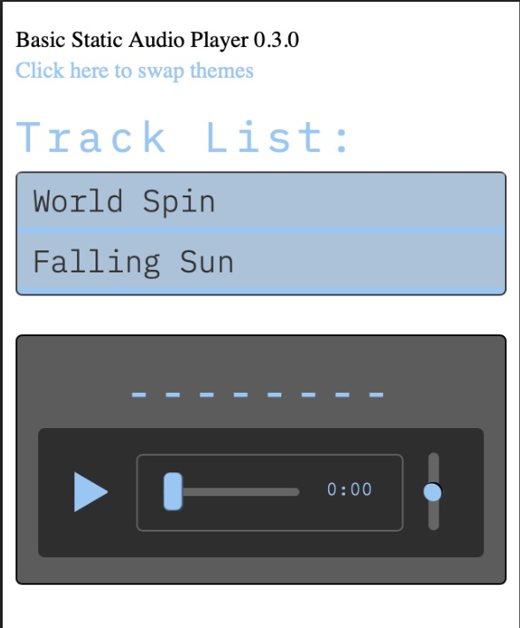
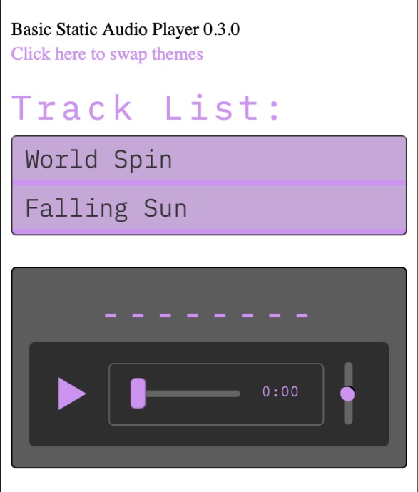

# JS Music Player
## Scope
The initial scope: a simple static mp3 player working with vanilla JS / HTML5 Audio api. The intent is for the musically inclined to have a simple way to share their creations via streaming. CSS variables allow for some simple quick color and font customizations.

## Tech
The initial static version is build with vanilla JS and the HTML5 audio element.

## The future
The future is not yet clear, but an expansion into a dynamic application would be built on an ExpressJS server with MongoDB and S3 compatible storage. It's possible I might go the ReactJS route for scalability and build out a platform.

## Usage
### html:
```html
<script type="module" src="./scripts/audio.js"></script>
<script src="./scripts/changeTheme.js"></script>
```

You'll need entry point with these ids for build nodes and 2 column formatting of css:
```html
<div id="trackListContainer">
    <div id="trackList"></div>
</div>
<div id="player" style="float:right;><div>
```

The keyboard control is a separate module and can be excluded if desired. Just remove
```javascript
import {keyboardControlListener} from './keyboardControls.js';
```
from `audio.js`

 