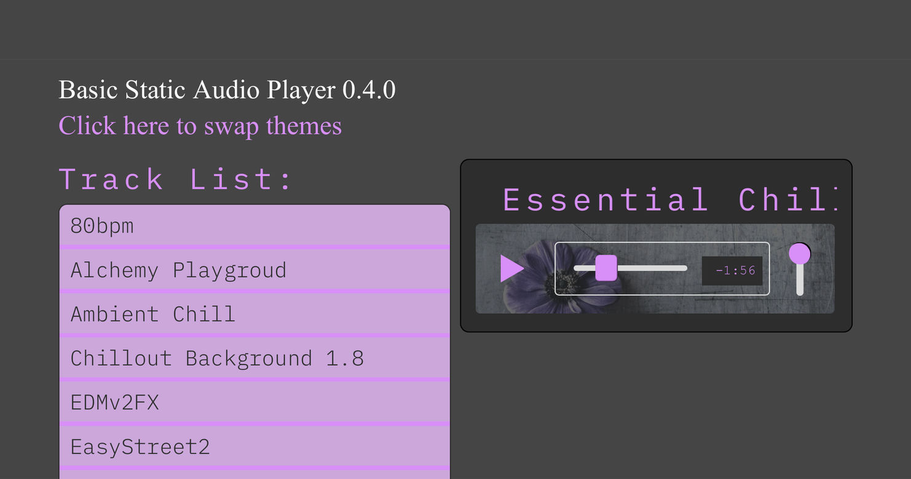
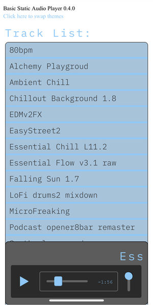
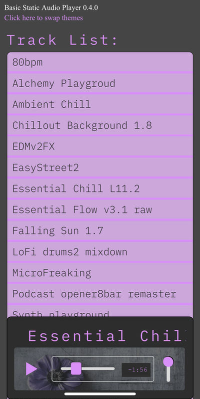

# JS Music Player



[Scope](#Scope) | [Tech](#Tech) | [Usage](#Usage) | [Future](#The-future) 

## Features
The basic version of the JS Music Player is a single user selfcontained project streaming MP3s in a mobile first design. 
- Continuous playback toggle (defualts to off)
- Working volume control for mobile with background playback
- Landscape mobile layout
- Auto opening cover art when available
- keyboard controls for desktop
- Info button provides quick help information
---
## The Story So Far
I startd of working with the `<audio>` element and then realized that volume changes wouldn't work on mobile (or at least iOS). I'd looked at AudioContext a little previous and pieced that together the some odd quirks with Chrome and then Safari due to sturcturing and when AudioContext has to be intantiated. While there, I worked on converting everything ove to the Web Audio API. First off was working out out the fetch and node routes for streaming - except apparently fetch won't read as a stream (in Safari at least). After a lot of work had already gone into the conversion I concluded that it just wasn't going to work for mobile / slower network connections. In the end I went back to the `<audio>` element as source for the AudioContext. 

Sound audio bugs sill come across on occasion. I went through and converted all the audio to the same sample rate and bitrate which I think helped (only the sample rate should be relevant to AudioContext). Checks were put in place to try to only play once there's enough data already cached with current datarate.

---
## Scope
The initial scope: a simple static mp3 player working with vanilla JS / HTML5 Audio api. The musically inclined should have a simple way to share their ideas over the web in a mobile friendly way. CSS variables allow for some simple quick color and font customizations.

---
## Tech
 Vanilla ES6+ modular JS, HTML5, Node, ExpressJS
### Tracklist
1. On load the Tracklist hits the api to get array of tracks. 
2. Node checks to see if it already has an array - if not it reads the `process.env.MUSICDIR` file path to buid the array
3. Tracklist reads array, builds tracklist.
### Audio
1. Build the player
2. Call the Tracklist function to build the Tracklist
3. Audio adds the tracklist listener utililzing delegation.
4. On track requst build the AudioContext  from the Audio() element and apply meta to the player
5. Start playback

---
## Usage
### Config and deploy
Make sure you have a NodeJS compatible hosting provider, and check their deployment documentation. Usually you can just get the git url and follow below:

Download the project (clone) and then add your mp3s to the `client/public/music` directory. If you have cover art available make sure it uses the same name as the track with .jpg extension. I may add a default cover art option in the juture.

In terminal / windows powershell: the first line names the remote url followed by the url provided by your host. In this example we're naming it heroku. We then add all changed added files. We then save those additions followed by sending them to the host to deploy.

```shell
git remote add heroku <heroku provided url>
git add . -f
git commit -m "added files"
git push heroku master
```
### Use the player in your own project:
If you just want to use the core player you'll need audio.js and feed your source into it as an array of object(s). `trackData = [{url: url, title: title, id: id}]`
### html
```html
<script type="module" src="./scripts/audio.js"></script>
```

You'll need entry point with these ids for build nodes and 2 column formatting of css:
```html
<div id="trackListContainer">
    <div id="trackList"></div>
</div>
<div id="player"><div>
```

The keyboard control is a separate module and can be excluded if desired. Just remove
```javascript
import {keyboardControlListener} from './keyboardControls.js';
```
from `audio.js`

 

---
## The future
The future is not yet clear, but an expansion into a dynamic application would be built with MongoDB and S3 compatible storage. It's possible I might go the ReactJS route for scalability and build out a platform.