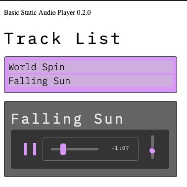

# JS Music Player
## Scope
The initial scope: a simple static mp3 player working with vanilla JS / HTML5 Audio api. The intent is for the musically inclined to have a simple way to share their creations via streaming. CSS variables allow for some simple quick color and font customizations.

## Tech
The initial static version is build with vanilla JS and the HTML5 audio element.

## The future
The future is not yet clear, but an expansion into a dynamic application would be built on an ExpressJS server with MongoDB and S3 compatible storage. It's possible I might go the ReactJS route for scalability and build out a platform.

