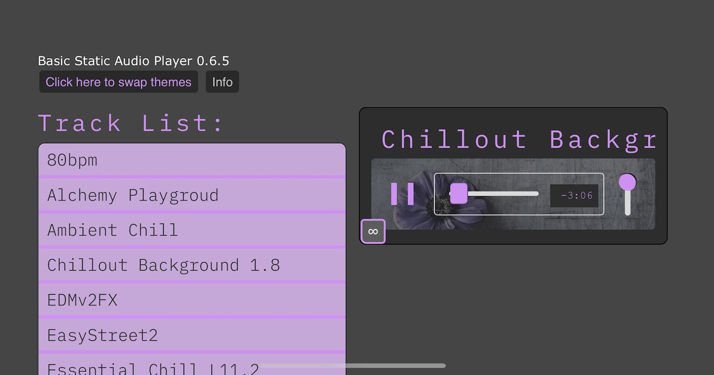

# JS Music Player



[Scope](#Scope) | [Tech](#Tech) | [Future](#The-future) | [Usage](#Usage)
## The Story So Far
I startd of working with the `<audio>` element and then realized that volume changes wouldn't work on mobile (or at least iOS). I'd looked at AudioContext a little previous and pieced that together the some odd quirks with Chrome and then Safari due to sturcturing and when AudioContext has to be intantiated. While there, I worked on converting everything ove to the Web Audio API. First off was working out out the fetch and node routes for streaming - except apparently fetch won't read as a stream (in Safari at least). After a lot of work had already gone into the conversion I concluded that it just wasn't going to work for mobile / slower network connections. In the end I went back to the `<audio>` element as source for the AudioContext. 

Sound audio bugs sill come across on occasion. I went through and converted all the audio to the same sample rate and bitrate which I think helped (only the sample rate should be relevant to AudioContext). Checks were put in place to try to only play once there's enough data already cached with current datarate.
## Scope
The initial scope: a simple static mp3 player working with vanilla JS / HTML5 Audio api. The intent is for the musically inclined to have a simple way to share their creations via streaming. CSS variables allow for some simple quick color and font customizations.

## Tech
 Vanilla ES6+ modular JS, HTML5, Node, ExpressJS
### Tracklist
1. On load the Tracklist hits the api to get array of tracks. 
2. Node checks to see if it already has an array - if not it reads the `process.env.MUSICDIR` file path to buid the array
3. Tracklist revieves array, builds tracklist, and appends to the DOM with listeners
### Audio
1. Build the player
2. Call the Tracklist function to build the Tracklist
3. On track requst build the AudioContext  from the Audio() element and apply meta to the player
4. Start playback
## The future
The future is not yet clear, but an expansion into a dynamic application would be built on an ExpressJS server with MongoDB and S3 compatible storage. It's possible I might go the ReactJS route for scalability and build out a platform.

## Usage
If you just want to use the core player you'll need audio.js and feed you're source into it as an array of object(s). `[{trackData: url,trackData: title}]`
### html
```html
<script type="module" src="./scripts/audio.js"></script>
```

You'll need entry point with these ids for build nodes and 2 column formatting of css:
```html
<div id="trackListContainer">
    <div id="trackList"></div>
</div>
<div id="player"><div>
```

The keyboard control is a separate module and can be excluded if desired. Just remove
```javascript
import {keyboardControlListener} from './keyboardControls.js';
```
from `audio.js`

 